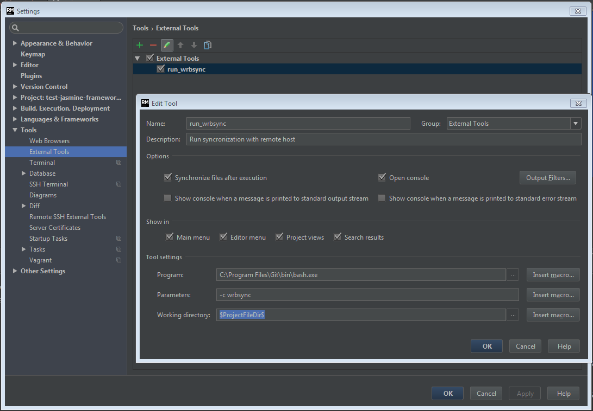
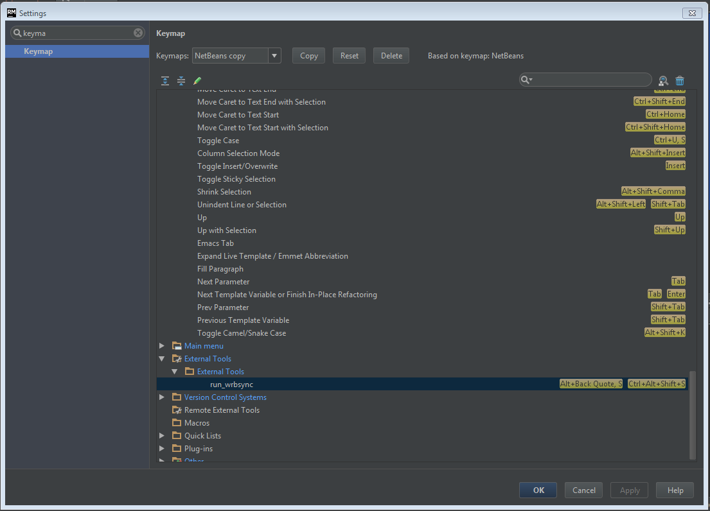

# Bidirectional Windows-Linux Syncronization Tool for Rails Development
I work under Windows, but I need to execute my Ruby on Rails project under Linux virtual machine. [Vagrant](https://www.vagrantup.com/) and VirtualBox Shared Folders has some limits for Windows syncronization, like symlincs, or uncorrect file timestamps.


To provide bidirectional syncronization from windows to linux I wrote this Bash wrapper over the [unison](https://www.cis.upenn.edu/~bcpierce/unison/) tool. 

## Setup

First need install unison under linux virtual machine:
```
aptitude search unison
```

On Windows clone this project:
```
git clone https://github.com/AlexKalinin/windows-ruby-dev-helper.git
```

and add path to the `windows-ruby-dev-helper/` folder to system path.

## Usage

Now run your Windows Bash interpreter (if you have no, you can download it with [git for windows](https://git-scm.com/download/win)), got to the project:
```
cd /c/prj/myproj
```

Create `.wrbsync` file here:
```
myproj$  touch .wrbsync
```

Setup `.wrbsync` file (see [.wrbsync.sample](https://github.com/AlexKalinin/windows-ruby-dev-helper/blob/master/.wrbsync.sample)): 
```
# /c/prj/myproj/.wrbsync
REMOTE_SSH_USERNAME=hedin
REMOTE_SSH_HOST=localhost
REMOTE_SSH_PORT=2222
REMOTE_DIR_PATH="/home/hedin/test-jasmine-framework"

# relative path to exclude from syncronization 
# this variable can be not set
declare -a UNISON_IGNORE_OPTIONS=("Path {.git}" "Path {.idea}" "Path {tmp}" "Name .gitignore")
```

Then run sync command:
```
myproj$  wrbsync
```

It will create automatically folder `test-jasmine-framework` in `hedin@localhost:/home/hedin` and will syncronize all current project folder content to remote.

Each time run will syncronize files bidirectionally.

For speedup process, for example for Ruby Mine, I created Tools --- External Tool, and binded Ctrl+Alt+Shift+S shurtcut for syncronization task. Params are:
```
name: any
programm: C:\Program Files\Git\bin\bash.exe
parameters: -c wrbsync
working directory: $ProjectFileDir$
```

see screenshots:




